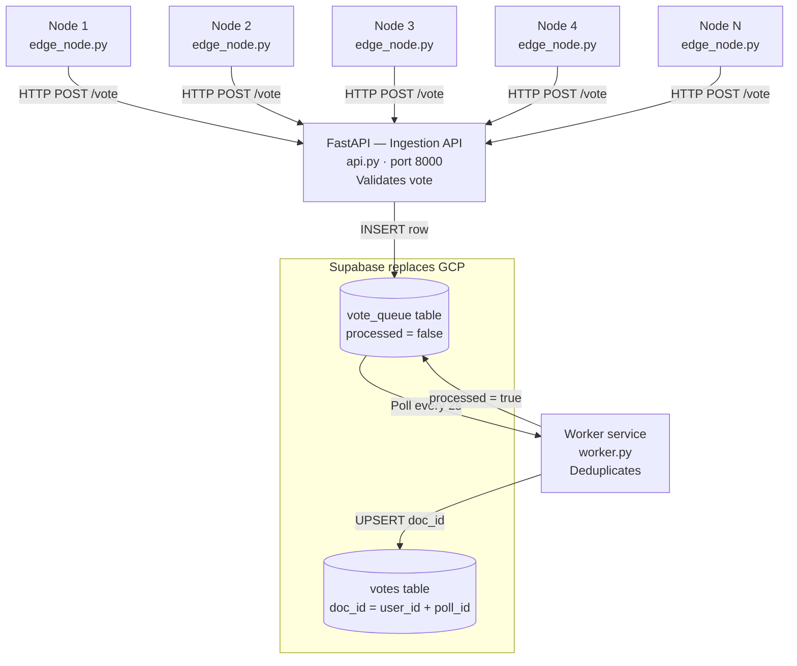

### Distributed Voting System - Supabase Architecture:

```mermaid

graph TD
    N1[Node 1\nedge_node.py] -->|HTTP POST /vote| API
    N2[Node 2\nedge_node.py] -->|HTTP POST /vote| API
    N3[Node 3\nedge_node.py] -->|HTTP POST /vote| API
    N4[Node 4\nedge_node.py] -->|HTTP POST /vote| API
    N5[Node N\nedge_node.py] -->|HTTP POST /vote| API

    API[FastAPI — Ingestion API\napi.py · port 8000\nValidates vote]

    API -->|INSERT row| Q[(vote_queue table\nprocessed = false)]

    Q -->|Poll every 2s| W[Worker service\nworker.py\nDeduplicates]

    W -->|UPSERT doc_id| V[(votes table\ndoc_id = user_id + poll_id)]
    W -->|processed = true| Q

    subgraph Supabase [Supabase replaces GCP]
        Q
        V
    end

```