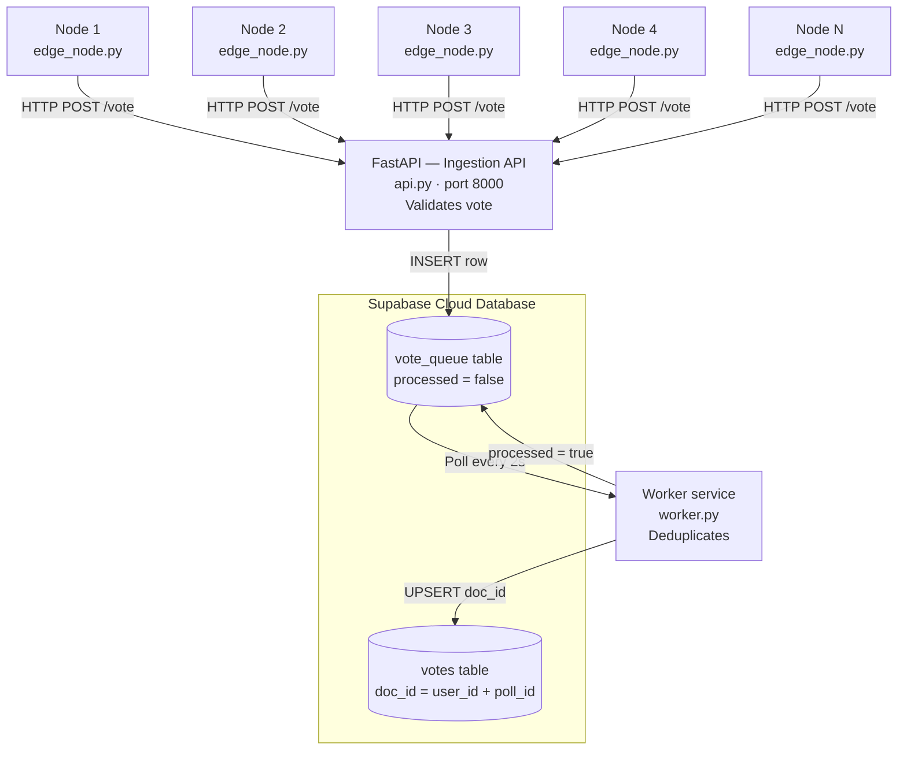

# Distributed Voting System with Edge–Cloud Architecture and Fault Tolerance
### Using Supabase as Cloud Backend

---

## System Overview

This project implements a **Distributed Voting System** that simulates an event-driven edge-to-cloud data pipeline. Multiple independent edge nodes generate votes and transmit them to a cloud-hosted ingestion API. A background worker service consumes those votes asynchronously, applies deduplication, and stores the final results in a persistent database.

The system is designed to remain functional even when individual components fail — demonstrating real-world distributed system principles such as fault tolerance, eventual consistency, and idempotency.

---

## Architecture

Instead of Google Cloud Platform (GCP), this implementation uses **Supabase** as the cloud backend, replacing the GCP services as follows:

| GCP Service | Supabase Equivalent |
|---|---|
| Cloud Run (API) | FastAPI running locally or on Render |
| Pub/Sub (message queue) | `vote_queue` table in Supabase (polled by worker) |
| Firestore (storage) | `votes` table in Supabase |

### Data Flow Diagram



### Component Descriptions

- **Edge Nodes (`edge_node.py`)** — Simulate distributed user devices. Each node independently generates unique votes with a random delay and sends them to the API via HTTP POST. Multiple group members run their own instance to create concurrent data sources.

- **Ingestion API (`api.py`)** — A lightweight FastAPI service that receives incoming vote requests, validates required fields, and inserts them into the `vote_queue` table in Supabase. It does not perform processing — only ingestion.

- **Vote Queue (`vote_queue` table)** — Acts as a message buffer (equivalent to Pub/Sub). Votes sit here with `processed = false` until the worker picks them up.

- **Worker Service (`worker.py`)** — Continuously polls the `vote_queue` for unprocessed votes every 2 seconds. It deduplicates using a composite key (`user_id + poll_id`), writes the final vote to the `votes` table via upsert, and marks the queue entry as processed.

- **Votes Table (`votes` table)** — The final persistent storage layer. Each document is uniquely identified by `doc_id = user_id_poll_id`, ensuring idempotent writes even if a vote is delivered more than once.

---

## Repository Structure

```
7th_Group_Act_FinTerm/
├── api.py            # FastAPI ingestion API
├── worker.py         # Background worker service
├── edge_node.py      # Edge node vote generator
├── setup.sql         # Supabase table definitions
├── requirements.txt  # Python dependencies
├── .env              # Environment variables
├── .env.example      # Template for environment variables
├── .gitignore
└── README.md
```

---

## Setup and Execution Instructions

### Prerequisites

- Python 3.9 or higher
- A [Supabase](https://supabase.com) account (free tier is sufficient)
- `pip` for installing Python packages

---

### Step 1: Clone the Repository

```bash
git clone <your-repo-url>
cd 7th_Group_Act_FinTerm
```

---

### Step 2: Create a Supabase Project

1. Go to [https://supabase.com](https://supabase.com) and sign in.
2. Click **New Project** and fill in the project name (e.g., `cs323-voting-system-group7`).
3. Choose a region close to your location (e.g., Southeast Asia).
4. Wait for the project to finish provisioning.

---

### Step 3: Set Up the Database Tables

1. In your Supabase project dashboard, go to **SQL Editor**.
2. Copy the entire contents of `setup.sql` and paste it into the editor.
3. Click **Run** to create the `vote_queue` and `votes` tables.

You should now see both tables under **Table Editor**.

---

### Step 4: Get Your Supabase Credentials

1. In your Supabase project, go to **Project Settings → API**.
2. Copy:
   - **Project URL** (e.g., `https://xyzxyz.supabase.co`)
   - **Service Role Key** (under "Project API keys" — use the `service_role` key, not `anon`)

---

### Step 5: Configure Environment Variables

Copy the example environment file and fill in your credentials:

```bash
cp .env.example .env
```

Edit `.env`:

```env
SUPABASE_URL=https://your-project-id.supabase.co
SUPABASE_KEY=your-service-role-key-here
API_URL=http://localhost:8000/vote
```

> If the API is deployed remotely (e.g., on Render), replace `API_URL` with the deployed endpoint URL.

---

### Step 6: Install Python Dependencies

```bash
pip install -r requirements.txt
```

---

### Step 7: Run the System

You need **2 separate terminals** running simultaneously.


#### Terminal 1 — Start the Worker Service

```bash
python worker.py
```

You should see:
```
Worker service starting, listening for votes...
```

#### Terminal 2 — Start an Edge Node

Before running, open `edge_node.py` and change the `EDGE_ID` variable to match your name:

```python
EDGE_ID = "node_your_name_here"
```

Then run:

```bash
python edge_node.py
```

You should see vote generation logs:
```
[SENT] Edge: node_your_name | User: <uuid> | Choice: A | Total Sent: 1
```

> Each group member should run `edge_node.py` independently with their own `EDGE_ID` to simulate multiple concurrent edge nodes.

---

### Step 8: Verify Data in Supabase

1. Go to your Supabase project dashboard.
2. Open **Table Editor → vote_queue** to see incoming votes being inserted.
3. Open **Table Editor → votes** to see processed votes being stored.

Both tables should populate in real time as the system runs.

---

## Individual Reflections

### Anino's Reflection

This activity was one of the more hands-on experiences I had because we had to set up and run multiple components at the same time. At first it was confusing managing the edge node, the API, and the worker all running separately since they all depend on each other. Setting up Supabase also took some getting used to especially making sure the tables were correct before running anything. The edge node part made sense to me because it simulates how real users send data at different times, and seeing multiple nodes sending votes simultaneously made it feel like a real system. The worker was the most interesting part because it handles all the processing, checks for duplicates, and stores the final vote. During fault injection testing when we stopped the worker I expected something to break but the votes just kept queuing up and once the worker came back it processed everything automatically without us doing anything manually. That part really showed me how distributed systems are designed to handle failures gracefully instead of just crashing. Overall this activity gave me a better picture of how real distributed systems work not just in theory but in actual running code.

---

### Antonio's Reflection

Implementing the distributed voting system using Supabase gave me a hands-on understanding of how distributed systems handle data across multiple independent components. I observed that unlike sequential execution, distributed execution allowed multiple edge nodes to generate and send votes simultaneously, which made the system faster but also introduced challenges in managing duplicate messages and ensuring data consistency. During the fault injection testing, I noticed that stopping the worker service caused votes to accumulate in the vote_queue table, but once the worker was restored, it automatically processed all queued votes without any manual intervention, which demonstrated the concept of eventual consistency. One of the biggest challenges I encountered was configuring the Supabase connection and ensuring that the API, worker, and edge nodes communicated correctly, especially when debugging asynchronous behavior across three separate terminals. Overall, this activity deepened my understanding of how real-world distributed systems use message queuing, idempotency, and fault tolerance to remain reliable even when individual components fail.

---

### Casia's Reflection

Working on this distributed voting system helped me better understand how distributed systems work in real-world environments. Our group used Supabase, I learned how cloud databases and asynchronous processing can still achieve reliable communication between edge nodes, APIs, and worker services. One thing I noticed was that distributed execution is more complex than normal sequential programs because multiple components run independently and failures can happen at different parts of the system. During testing, I observed that even when the worker service stopped, votes were still queued and processed once the service recovered, which showed the importance of fault tolerance and message buffering. Overall, this activity helped me understand the trade-offs between scalability, reliability, and system complexity in distributed computing.

---

### Espina's Reflection

My experience implementing this distributed voting system highlighted the stark contrast between traditional sequential logic and the decoupled nature of distributed architectures. By using Supabase as a middleware for queuing, I observed how distributed execution allows edge nodes to operate independently of the processing worker, which significantly improved the system's responsiveness under load. However, this also introduced a noticeable communication overhead and the need for rigorous synchronization; specifically, I learned that ensuring eventual consistency between the `vote_queue` and the final `votes` table requires careful status tracking and idempotent writes. During high-load testing, the system's latency increased as the worker polled for batches, yet the use of a persistent queue ensured that no data was lost even when the processing throughput lagged behind the ingestion rate. One of the most significant challenges was debugging the asynchronous flow across multiple services, where failures in one component — like a disconnected worker — did not crash the entire system but instead resulted in a temporary backlog. This taught me that while distributed systems introduce layers of complexity and debugging difficulty, they provide a level of fault tolerance and horizontal scalability that is simply unattainable in a monolithic, sequential environment.

---

### Flores's Reflection

Working on the distributed voting system using Supabase helped me understand how distributed systems coordinate multiple components such as edge nodes, the API, the worker service, and the database. Compared to sequential execution, the distributed setup allowed votes to be generated and processed asynchronously, making the system more responsive and scalable. I observed that votes were added to the vote_queue and processed later by the worker, showing message buffering and eventual consistency when components operated independently. When the worker was not immediately processing votes, items stayed in the queue and were handled once processing resumed, and when the worker service stopped, votes accumulated and were processed after it restarted, demonstrating fault tolerance and recovery. One challenge was debugging asynchronous behavior across multiple services since issues could come from different components, and overall the activity showed the trade-off between improved scalability and increased system complexity in distributed systems.